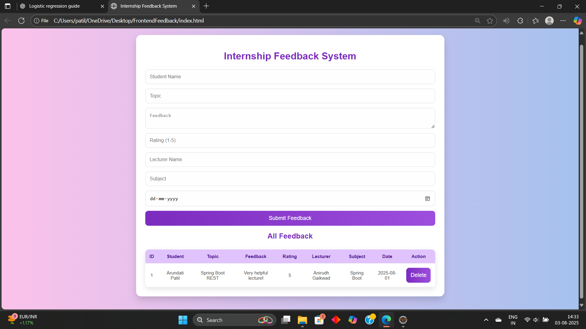
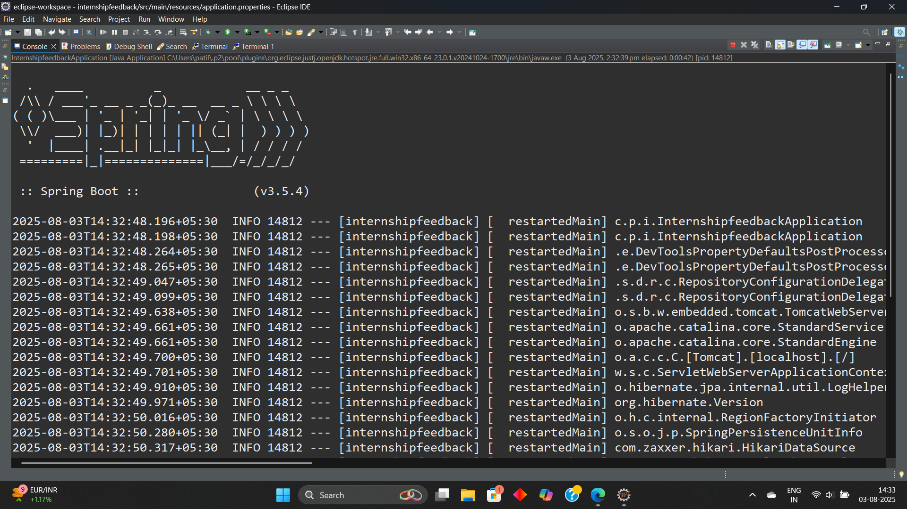

#  * Internship-Feedback-Managment-System *

A modern, responsive web application designed to streamline the collection and management of student feedback for internship lectures. This system enables students to effortlessly submit feedback on lectures they attend, rating the content, lecturer, and overall experience. Administrators can log in to review, analyze, and manage all feedback entries with powerful tools like data visualization, deletion control, and PDF export. Built using Spring Boot (REST API) and PostgreSQL on the backend, with a clean and intuitive HTML, CSS, and JavaScript frontend, the system ensures a seamless user experience for both students and admins.

---

## Project Overview

This system allows students to submit feedback after internship lectures including:
- Rating (1 to 5)
- Topic Feedback
- Lecturer Name, Subject, and Lecture Date
Admin can log in, view all feedback, and manage records.


---

##  Technologies Used

| Layer        | Technology                      |
|--------------|----------------------------------|
| Backend      | Spring Boot, Spring Web, REST API |
| Database     | PostgreSQL                       |
| Frontend     | HTML, CSS, JavaScript (Vanilla)  |
| Tools        | Maven, Eclipse IDE, Git, Postman |

---

##  Features

- Student Feedback Form  
- View Submitted Feedback  
- Add Lecturer Details  
- Rating System  
- Admin View & Delete  
- Feedback Charts  
- PDF Export  
- Simple Email Login


---

##  Project Structure

```
📁 internshipfeedback/
 ┣ 📁 src/
 ┃ ┣ 📁 main/
 ┃ ┃ ┣ 📁 java/com/example/controller/
 ┃ ┃ ┣ 📁 java/com/example/entity/
 ┃ ┃ ┣ 📁 java/com/example/repository/
 ┃ ┃ ┣ 📁 java/com/example/service/
 ┃ ┃ ┗ 📁 resources/
 ┃ ┃   ┗ 📄 application.properties
 ┣ 📁 static/
 ┃ ┣ 📄 style.css
 ┃ ┗ 📄 app.js
 ┣ 📁 templates/
 ┃ ┗ 📄 index.html
 ┣ 📄 README.md
 ┗ 📄 pom.xml
```

---

##  User Roles


| Role    | Access                                      |
|---------|---------------------------------------------|
| Student | Submit feedback                             |
| Admin   | View/Delete feedback, Monitor performance   |


---


##  REST API Endpoints

| Method | Endpoint                | Description            |
|--------|-------------------------|------------------------|
| GET    | /feedback/all           | Get all feedback       |
| POST   | /feedback/save          | Submit feedback        |
| DELETE | /feedback/delete/{id}   | Delete feedback by ID  |


---


##  Sample API Response

### GET `/api/feedback`
```json
[
  {
    "id": 1,
    "studentName": "Arundati Patil",
    "topic": "Spring Boot Introduction",
    "feedback": "Very informative lecture",
    "rating": 5,
    "lecturer": "Anirudh Gaikwad",
    "subject": "Java Backend",
    "lectureDate": "2025-07-25"
  }
]


```

##  How to Run

### Backend (Spring Boot)

```bash
1. Open in Eclipse
2. Run main application class
3. Make sure PostgreSQL is running
4. Backend URL: http://localhost:8096
```

### Frontend

```bash
1. Open index.html in your browser
2. Submit feedback
3. See table updates automatically
```

---

## Screenshots

### Frontend Form  



### Backend API  


---


##  GitHub Repo


 [Internship Feedback Management System on GitHub](https://github.com/patilarundhati44/Internship-Feedback-Managment-System-)


---

## Project Developed By

  •  Name: Arundati Anand Patil  
  
  •  Education: Diploma (Information Technology) – 3rd Year  

  •  College: SVERI College of Engineering (Poly), Pandharpur  

  •  Email: patilarundhati44@gmail.com  

  •  Internship Guide: Anirudh Gaikwad


